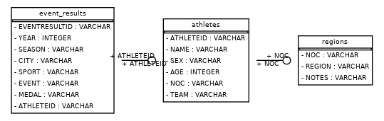
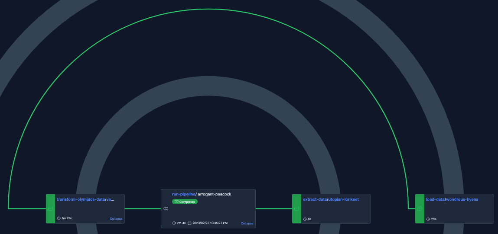

# olympics_etl

## Overview
This project is designed to run an ETL process on Olympics data by using Prefect. If you follow the Running Locally 
instructions, you can create docker containers for development as well as a PostgreSQL instance to store the results. 
The Prefect flows and associated code to run the ETL can be found in `/prefect_flows`. 
Some example analysis can be found in `/analysis`.

## Running locally
To easily run this project locally, first clone the repository and download the VS Code extension, [Dev Containers](https://code.visualstudio.com/docs/devcontainers/create-dev-container). Create a .env file in the root directory with the following secrets:
- AWS_ACCESS_KEY_ID
- AWS_SECRET_ACCESS_KEY
- POSTGRES_USER
- POSTGRES_DB
- POSTGRES_PASSWORD
- POSTGRESS_SERVER
If running on WSL, use `wsl hostname -I` in PowerShell to get IP address for POSTGRESS_SERVER, otherwise use `0.0.0.0`.

This requires an AWS account with an S3 bucket called `raw-csv-storage`, with a sub-directory called `raw-olympics`, CSV files stored in that directory, and an AWS access key with read permissions on that bucket.

Then, via the command pallet in VS Code (command + p by default), type '>' and run 'Rebuild in Container'. Once the containers are up and running, you can run `python3 prefect_flows/main.py` in the dev container terminal to run the pipeline. Use a database query tool of your choice to query the local PostgreSQL instance on port 5432 to see the results.

You can also deploy the Prefect pipeline to run on an hourly schedule by running `python3 prefect_flows/deploy.py`.

## Entity Relationship Diagram

## Radar Graph of Prefect Deployment

